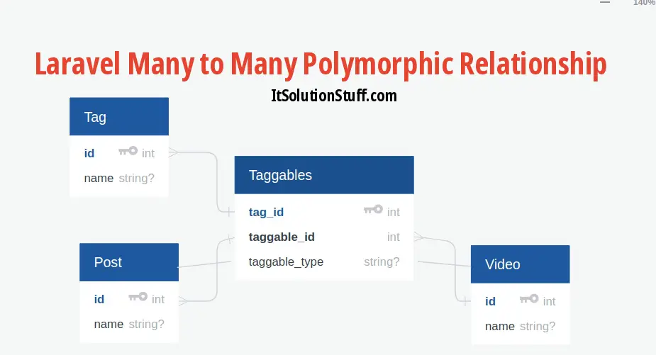

<!--markdown tutorial-->

<h1  align="center">Mushahedur Rahman Khan</h1>

 <br/>
 
---
  <br/>

## Authentic Blog Project with Laravel


### Introduction :
<p>This is my  authentic blog project, here anyone can sign up then can login. When authorized person login whose can create blog post with Laravel</p>

## Tools:
- Front-end: HTML, CSS, Bootstrap, JavaScript
- Back-end: PHP, MySQL

## Design : 
### Front-end Design: 
- Home page
- Login page
- Sign Up page

### Back-end:
 - When any person can signup and signin
 - Add a post with title
- Post and title show Home Page
- And post below the comment section
- Anyone can comment any post
- Same time show comment under the post

 <br/>
 
---
  <br/>

<p> —---------------------------------------------------------------------------------------------------------------- </p>

<br/>

### Drow SQL
<!--  -->

<br/>

<h1  align="center">Project-based  New Learning </h1>


## Many-to-many-poly-relationship-laravel

<br/>

<!--  -->

<br/>


### This is the comment table Schema: 

```
Schema::create('comments', function (Blueprint $table) {
    $table->increments('id');
    $table->morphs('commentable');
    $table->text('comment')->nullable();
    $table->timestamps();
});

```

<br>

### This is Image Model comment Function

```
public function comments()
{
    return $this->morphMany(Comment::class,'commentable');
     //App\Models\ImageModel
}

```

<br>

### This is Post Model comment Function

```
public function comments()
{
    return $this->morphMany(Comment::class,'commentable');
                //App\Models\PostModel
}


```


<br>

### How to get All post with comment By HomeController 

```
function blogIndex(){
    $post = PostModel::with('comments')->orderBy('id', 'desc')->take(4)->get();
    return view('website.pages.blog_page',compact('post') );
}

```


<br>

### How to get All Image with comment By HomeController 

```
function imageIndex(){
        $image = ImageModel::with('comments')->orderBy('id', 'desc')->take(6)->get();


        return view('website.pages.image_page',compact('image'));
     }
```

#### Link: https://blog.logrocket.com/polymorphic-relationships-laravel/ 
