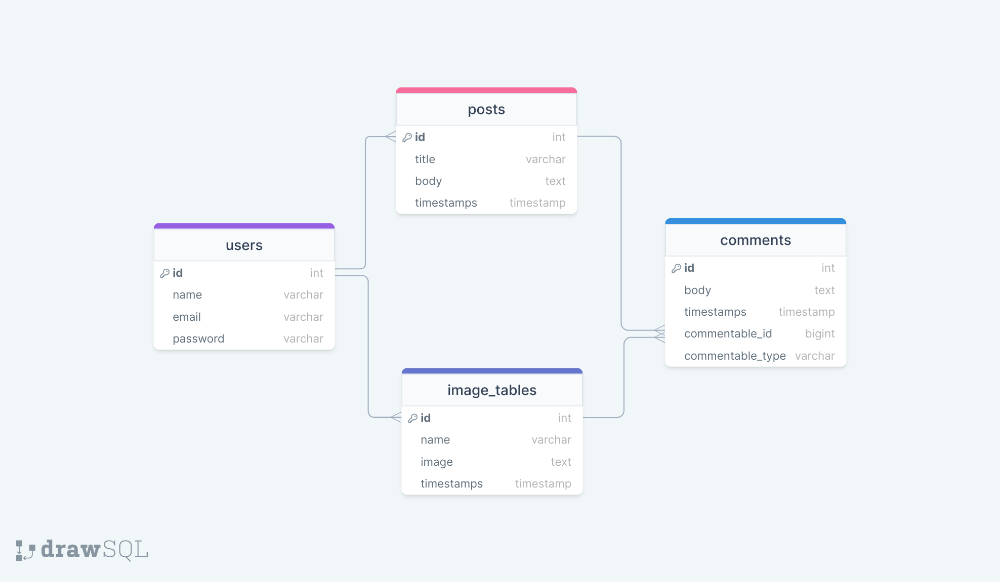

<!--markdown tutorial-->

<h1  align="center">Mushahedur Rahman Khan</j1>

  
 
---
   

## Authentic Blog Project with Laravel

### Introduction :

This is my  authentic blog project, here anyone can sign up then can login. When authorized person login whose can create blog post with Laravel

## Tools:
- Front-end: HTML, CSS, Bootstrap, JavaScript
- Back-end: PHP, MySQL

## Design : 
### Front-end Design: 
- Home page
- Login page
- Sign Up page

### Back-end:
 - When any person can signup and signin
 - Add a post with title
- Post and title show Home Page
- And post below the comment section
- Anyone can comment any post
- Same time show comment under the post

  
 
---
   

 —---------------------------------------------------------------------------------------------------------------- 

 

### Drow SQL
<!--  -->

 

